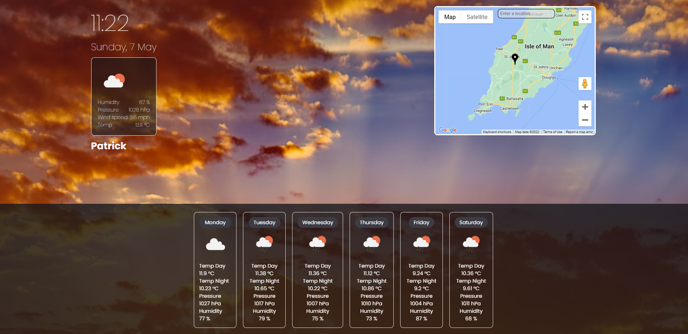

## USER STORY
AS A NATIONAL TOURIST AGENCY,
I WANT A WEB APPLICATION TO SHOW THE WEATHER ON A MAP AND STORE WEATHER INFORMATION ON NEXT 5 DAYS IN DIFFERENT LOCATION   
SO THAT TOURIST CAN MAKE GOOD PLAN BASED ON THE WEATHER FOR THEIR TRIP

## PROJECT DISCRIPTION 
This platform allows the user to click a city on the map. In response to clicking, current weather information for the day and the weather forecast for the next 6 days are displayed to the user.

The user can add more cities if they wish to monitor the weather in that city. The user’s selection is stored locally, and upon revisiting the platform, they can view their previous selections. 

